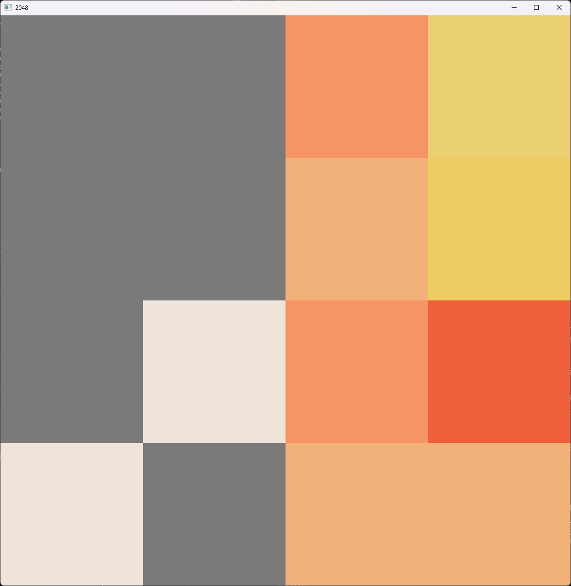

# auto2048

A 2048 game clone with a predictive algorithm.



## Controls

`WASD` or arrow keys to move. \
`F` to toggle autoplay \
`G` to make a single computer move \
`R` to reset

## Compiling

In a Windows terminal, run the following command:

```cmd
.\make.bat
```

This will run a Makefile to compile the program with SDL2 linked.

Then you can start the application with the following command:

```cmd
.\Main.exe
```

## License

This is licensed under the MIT license.